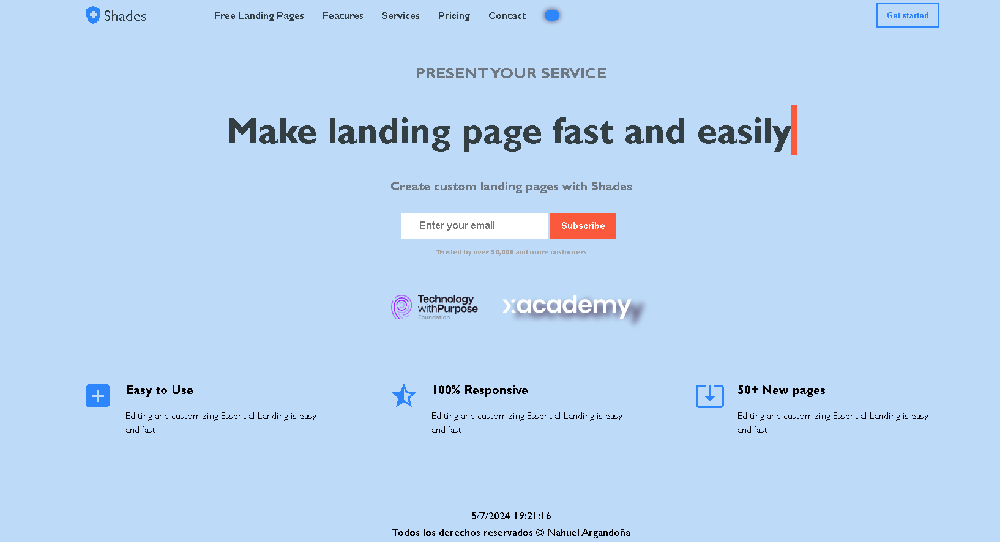

# Landing Page para xAcademy y Santex

Este proyecto consiste en una landing page creada con HTML y CSS, siguiendo los conocimientos adquiridos en el curso. La landing page tiene como objetivo presentar los servicios de una entidad ficticia.

## Tecnologías
Estructura del Proyecto
El proyecto está compuesto por los siguientes archivos:

- `main.html`: Contiene la estructura HTML de la landing page.
- `main.css`: Contiene los estilos CSS para la presentación visual de la landing page.
- `Dockerfile`: Contiene la configuracion para levantar el servidor con docker y nginx en el puerto 80.

Además, se incluyeron **Google Fonts** para personalizar la fuente y **Material Icons** para incorporar íconos como flechas y logos de redes sociales populares.

<figure></figure>

## Instrucciones para levantar el contenedor Docker

Sigue estos pasos para levantar el contenedor Docker con tu configuración:

1. **Organiza tus archivos**: Asegúrate de tener los siguientes archivos en el mismo directorio:
   - `Dockerfile`
   - `intex.html`
   - `index.css`

2. **Construye la imagen Docker**: Abre una terminal, navega al directorio donde tienes los archivos y ejecuta el siguiente comando:

   - docker build -t mi-sitio-web .

3. **Ejecuta el contenedor**: Una vez que la imagen se haya construido correctamente, puedes ejecutar el contenedor con el siguiente comando:

   - docker run -d -p 80:80 mi-sitio-web

Este comando inicia el contenedor en modo desacoplado (-d) y mapea el puerto 80 del host al puerto 80 del contenedor.

4. Verifica que el contenedor esté funcionando: Puedes verificar que el contenedor está en ejecución con el siguiente comando:

   - docker ps

Deberías ver una lista de contenedores en ejecución, incluyendo mi-sitio-web.

5. Accede a tu sitio web: Abre un navegador web y navega a http://localhost. Deberías ver tu archivo index.html cargado con el estilo de index.css