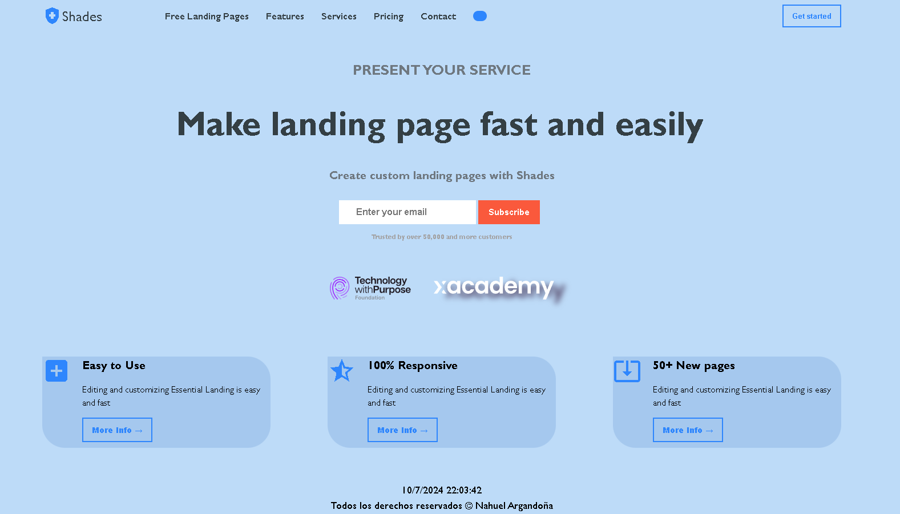

# Landing Page para xAcademy y Santex
Este proyecto consiste en una landing page creada con HTML y CSS, siguiendo los conocimientos adquiridos en el curso. La landing page tiene como objetivo presentar los servicios de una entidad ficticia.

## Tecnologías
Estructura del Proyecto
El proyecto está compuesto por los siguientes archivos:

main.html: Contiene la estructura HTML de la landing page.
main.css: Contiene los estilos CSS para la presentación visual de la landing page.

Además, se incluyeron **Google Fonts** para personalizar la fuente y **material icons** para incorporar íconos como flechas y logos de redes sociales populares. 

<figure></figure>